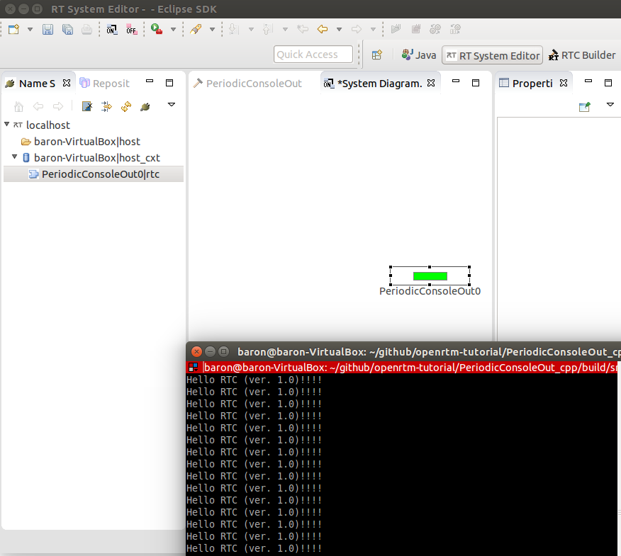

#Step 1: Periodic Console Output RTC

## Generate Skeleton Code
Use Eclipse with RTC Builder (RTCB). We also use RT System Builder (RTSE) to monitor the state condition of RTCs.

### RTC Builder
Launch Eclipse with RTCB.
Then, select menu > “Window” > “Perspective” > “RTCBuilder”.
 

Select menu > “File” > “Open new Builder Editor”.
First you will be required to input your project name.
Then you can find the editor like following figure.
 

## PERIODIC Component
Let’s make RTC which just output strings on console periodically.

### RTC Builder
Select tabs below, and input configuration of your RTC. These are usual steps to build RTC.
 

| TAB | PARAMETER | VALUE |
|---|---|---|
| Basic | Module name | PeriodicConsoleOut |
| | Module description | Periodic Console Out Component |
| | Module version | 0.0.1 |
| | Module vender | Your Name |
| | Module category | Your category (Test) |
| | Component type | STATIC |
| | Component Kind | Data Flow |
| | Component’s activity type | PERIODIC |
| | Number of maximum instance | 1 |
| | Execution Type | Periodic Execution Context |
| | Execution Rate | 1.0 |
| | Abstract | |
| | RTC Type | |
| | Output Project | PeriodicConsoleOut |
| Activity | on_execute | ON |
| Lang & Environemnt | Language | C++　/ Java / Python |

Please check carefully to select activity.
 

### Generate
Then push generate button

### Edit Source Code
Then, edit PeriodicConsoleOut.cpp file.
You can concentrate to onExecute function.

If you forgot checking the checkbox of “on_execute” in Activity tab of RTC builder, you must manually uncomment the onExecute function both in .cpp and .h.
```
RTC::ReturnCode_t PeriodicConsoleOut::onExecute(RTC::UniqueId ec_id)
{
  std::cout << "Hello RTC (ver. 1.0)!!!!" << std::endl;
  return RTC::RTC_OK;
}
```
cmake and make it

### rtc.conf
Before launching RTCs, you need to configure the RTC. Let’s edit “rtc.conf”.

In this file, you can configure….

* Execution period
* Address of Name Service (URL or IP address)
* Naming Rule
* Logger setting
* Setting of CORBA

Please add Name Server’s address like below:

#### Before
exec_cxt.periodic.rate:1.0

#### After
exec_cxt.periodic.rate:1.0
corba.nameservers: localhost

### Launch RTCs
The sequence is…

1. Launch Name Service
1. Launch Eclipse (RT System Editor)
1. Set Name Server’s address for RTSE (sometimes automatically detected)
1. Launch RTC
1. Connect RTCs with RT System Editor (you do not have to do here)
1. Activate RTCs with RT System Editor

 

#### Change the execution period
In rtc.conf, “exec_cxt.periodic.rate” is setting for execution period (unit is Hz).

#### Column: Real Time?
You can imagine this normal RTCs do not support Real-Time execution period.
But if you use Linux and preemptive kernel, you can use Real-Time support.

#### Exit RTCs
Do not close DOS console window
If you close the DOS console window with X button, your RTC will become ZOMBIE in the Name Service.
 

In your RT System Editor, Zombie killer button is available.
 
