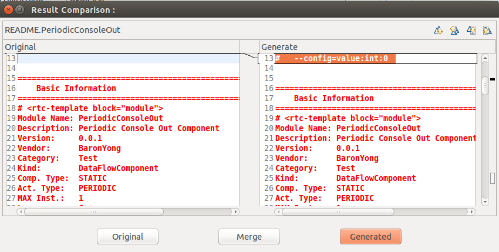
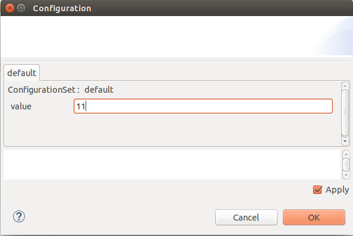

# Step 2: Configuration

Configuration is a function which dynamically (run-time) regulate the behavior of RT component. RTC can be configured in its runtime using Configuration.

Imagine RTC for motor-control.
If you prepare PID parameter as the configuration of the RTC, it can be configured without re-compile.

If you want to set some numerical parameters to RTCs, you can also use DataPorts.
Configuration is suitable for the purpose of low frequency parameter setting. The configuration can be automatically loaded from rtc.conf file. This might be one reason to use configuration.

## Continue from step 1
Import previous project. You can find RTC.xml file in the project folder
Open RTC Builder. Then select “import” button from “Basic” tab.


Select “RTC.xml” file in PeriodicConsoleOut folder.
 
## Append Configuration parameters
Select “configuration” tab, and press “Add” button.

* Parameter Name
    * name of the configuration. this is not the name of variables used in your codes. Here “value” is set.
* Type 
    * Type of configuration. You can use int, float, string, etc. Here “int” is set.
* Default Value 
    * default value. Here “0” is set.
* Variable Name
    * The name of variables. Here “param_value” is set.
* Unit
    * Unit of variables. For example, “meter”, “kilogram”, “miles” and so on. You can skip this.
* Constraint
    * maximum/minumum values can be set. You can skip this.
* Widget
    * You can change the presentation of setting dialog, like spin control, edit box, slider, and so on.
    


## Code generation
If you press “generate” button in “basic” tab, you can find some confirmation dialog for overwriting the project files.



## Coding
You can find onInitialize function is uncommented. Here, the parameters are bind to configurations. You do not have to modify the onInitialize function.

Let’s modify onExecute function.
We set the name of the variables as “param_value”, we can use “m_param_value”.
```
RTC::ReturnCode_t PeriodicConsoleOut::onExecute(RTC::UniqueId ec_id)
{
  std::cout << "Value = " << m_param_value << std::endl;
  return RTC::RTC_OK;
}//>
```

## rtc.conf
You can find a file to set default value of configuration.
In rtc.conf, the default value setting file is set as “Test.PeriodicConsoleOut.config_file:PeriodicConsoleOut.conf”

This is …

“category”.”component name or instance name”.config_file: file name

Category name can be set in RTC Builder.
If you use component name, default values of all components are set.
If you use instance name (like PeriodicConsoleOut0), only the specified instance is set.

## Launch RTC
Launch process is the same as the previous section.
1. Name Service
2. RTSE
3. Launch RTC

Then, if you select your RTC in RTSE, you can find the configuration setting menu in “Configuration View”.
The configuration view is usually displayed in the bottom region of RTSE.


Press Edit button, and modify “value”.



You must press “Apply” to apply the modified value.
You can see the value is modified.


