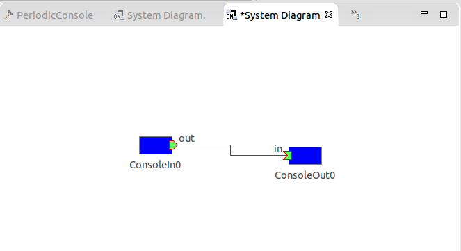

# Step 3: Data Port Communication (Push type)

Sender RTC which has OutPort(s)
Receiver RTC which has InPort(s) 

## ConsoleIn (RTC with OutPort)
ConsoleIn RTC receives your key inputs

### RTC Builder

| Tab | Parameter | Setting |
| --- | --- | --- |
| Basic | Module name | ConsoleIn |
| | Module description | Console In Component |
| | Module version | 1.0.0 |
| | Module vender | Your Name |
| | Module category | TEST |
| | Component type | STATIC |
| | Component Kind | Data Flow |
| | Component’s activity type | PERIODIC |
| | Number of maximum instance | 1 |
| | Execution Type | Periodic Execution Context |
| | Execution Rate | 1.0 |
| | Abstract | Not Important |
| | RTC Type | Not Important |
| | Output Project | ConsoleIn |
| Activity | on_execute | Check |
| Data Port(OutPort Profile) | PortName | out (Port name) |
| | DataType | TimedLong (Data type） |
| | VarName| out (variable which has data of the port) |
| | Disp. Position | RIGHT (Display position in RTSE) |
| Language & environment | Language | C++, Java, Python |

### Coding
You can find two variables “m_out” and “m_outOut”.
m_out is data buffer of OutPort, and m_outOut is OutPort itself. In the auto generated initialization code, both variables are connected so the data can automatically transported between two variables.

The writing sequence of OutPort is …
1. Write data to m_out (buffer).
2. Call m_outOut.write function.

```
RTC::ReturnCode_t ConsoleIn::onExecute(RTC::UniqueId ec_id)
{
  std::cout << "Input number:" << std::endl;
  std::cin >> m_out.data;
  m_outOut.write();
  return RTC::RTC_OK;
}
```

If out is sequence type (variable length array), you need to change the buffer length by calling “length” function.

```
RTC::ReturnCode_t ConsoleSeqIn::onExecute(RTC::UniqueId ec_id)
{	
	std::string value;
	std::cout << "Input number:" << std::ends;
	std::getline(std::cin, value);
	std::cout << "Data is " << value << std::endl;
	std::stringstream iss(value);
	long num;
	std::vector<long> numbers;
	while(iss >> num) numbers.push_back(num);
	std::cout << "size = " << numbers.size() << std::endl;
	m_out.data.length(numbers.size());
	for(unsigned int i = 0; i < numbers.size(); i++)
		m_out.data[i] = numbers[i];	
	m_outOut.write();
	return RTC::RTC_OK;
}//>
```

## ConsoleOut (RTC with InPort)

### RTC Builder
| Tab | Parameter | Setting |
| --- | --- | --- |
| Basic | Module name | ConsoleOut |
| | Module description | Console Out Component |
| | Module version | 1.0.0 |
| | Module vender | Your Name |
| | Module category | TEST |
| | Component type | STATIC |
| | Component Kind | Data Flow |
| | Component’s activity type | PERIODIC |
| | Number of maximum instance | 1 |
| | Execution Type | Periodic Execution Context |
| | Execution Rate | 1.0 |
| | Abstract | Not Important |
| | RTC Type | Not Important |
| | Output Project | ConsoleOut |
| Activity | on_execute | Check |
| Data Port(OutPort Profile) | PortName | in (name of port) |
| | DataType | TimedLong (Data type） |
| | VarName| in (variable of buffer) |
| | Disp. Position | LEFT (direction of display） |
| Language & environment | Language | C++, Java, Python |

### Coding
Edit onExecute function.

If you define InPort named “in”, you can find “m_in” and “m_inIn”.
“m_inIn” is InPort class object. You can use InPort#isNew function to check if the InPort received data (or not). If isNew returns true, you can receive data with InPort#read function.
When read function succeeded, the received data is copied to “m_in”, and you can get the data from m_in.data member.

```
RTC::ReturnCode_t ConsoleOut::onExecute(RTC::UniqueId ec_id)
{
  if (m_inIn.isNew())
  {
    m_inIn.read();
    std::cout << "Data is " << m_in.data << std::endl;
  }
  return RTC::RTC_OK;
}//>
```
If you use sequence, m_in.data is array. The length function (without any argument) returns the length of array received.
```
RTC::ReturnCode_t ConsoleSeqOut::onExecute(RTC::UniqueId ec_id)
{
	if(m_inIn.isNew()) {
		m_inIn.read();
		std::cout << m_in.data.length() << " datas received." << std::endl;
		for(int i = 0;i < m_in.data.length();i++) {
			std::cout << "Data is " << m_in.data[i] << std::endl;
		}
	}
  return RTC::RTC_OK;
}
```
### Execution
Edit rtc.conf file.
corba.nameservers: localhost:2809

Then, launch name service and execute ConsoleIn / ConsoleOut.

## Connection using RT System Editor
Select File -> “Open New System Editor”, then, drag / drop both RTCs from “Name Service View” to the editor

Next, connect both connectors by drag/drop. An dialog will be shown, immediately after you connect.
Then select “push” in Dataflow type.


Okay, you are ready to communicate.



When you activate both RTCs, you can find “Input number” in console of ConsoleIn.
Input number as you like, and then, press enter.
You can find the number you put in the console of ConsoleOut.

### RTC::TimedLong version


### RTC::TimedLongSeq version


## Column 
### subscription_type
Subscription type is very important, and you need to know if you manage the whole RT system.


You can select three types of subscription_type parameter.

#### flush
Immediately after you call OutPort#write, data is sent to InPort’s buffer. The write function blocks when the data is successfully transported.

#### new
The data is sent by another process, so write method does not block. This setting can select “push policy”.
ALL: all available datas in OutPort side buffer will be sent to InPort side.
FIFO: one data will be sent.
SKIP: a certain number of datas are sent.
NEW: the newest one is sent.

#### periodic
The data is sent periodically. You can not synchronize Sender and Receiver. If you set “push rate”, frequency of data transport can be changed, but tuning is difficult.
