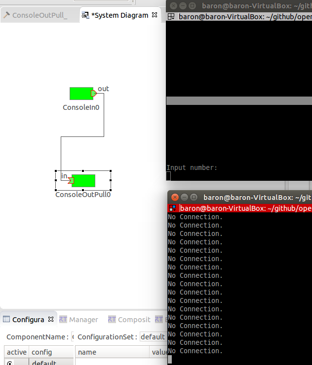
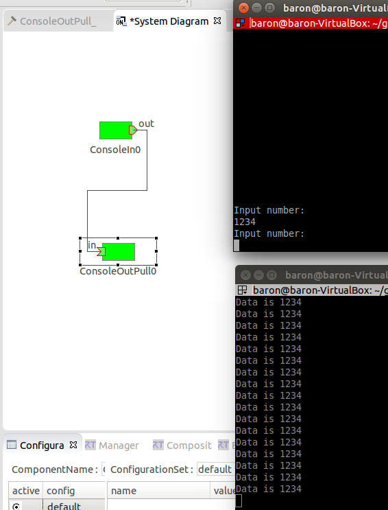
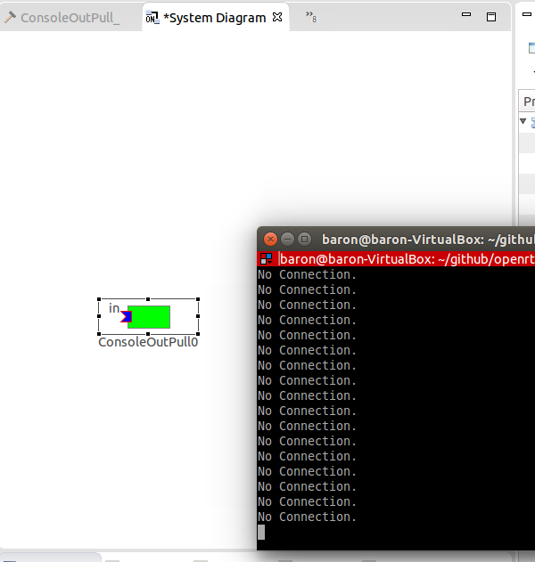

# Step 4: Data Port Communication (Pull type)


Let's try communicating between a component that has an output port and a component that has an input port.
In Pull type communication, we are not using isNew in InPort. Therefore, on the In side, read is called and the return value is checked.

## Component with input port
### Edit CPP file

Edit onExecute function. It reads about m_inIn declared as an InPort variable, retrieves the read data and displays it. The return value is a bool type, true for success, false for failure (no connection).

```
RTC::ReturnCode_t ConsoleOutPull::onExecute(RTC::UniqueId ec_id)
{
  if ( m_inIn.read() ) {
    std::cout << "Data is " << m_in.data <<
    std::endl;
  } else {
    std::cout << "No Connection." << std::endl;
  }
  return RTC::RTC_OK;
}//>
```

## Run the program
### When both ConsoleIn and ConsoleOutPull are activated


### When insert a number in ConsoleIn


### When ConsoleIn server is closed



## Difference between pull and push
After all, the difference between push and pull is whether or not there is a data buffer.

In the case of a push type connection, the InPort side buffer becomes active when the connection is established. When writing on OutPort side, the data transmission timing changes depending on subscription_type. (About subscription_type of push connection)

On the other hand, pull type has buffer on OutPort side. When you call read with InPort, data is exchanged using the CORBA object.

After all, this is the difference between the overhead of OutPort :: write and InPort :: read.

For the push type, the overhead of OutPort :: write is higher. However, depending on subscription_type, it is possible to avoid being blocked by the write method.

On the other hand, with pull type, the overhead of InPort :: read is high. There is currently no way to avoid this.