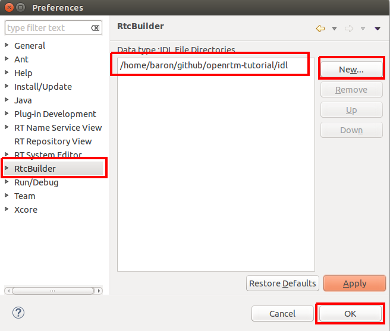
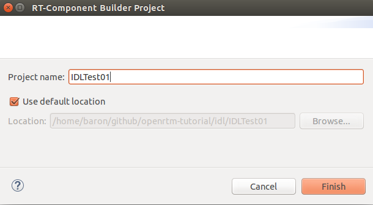
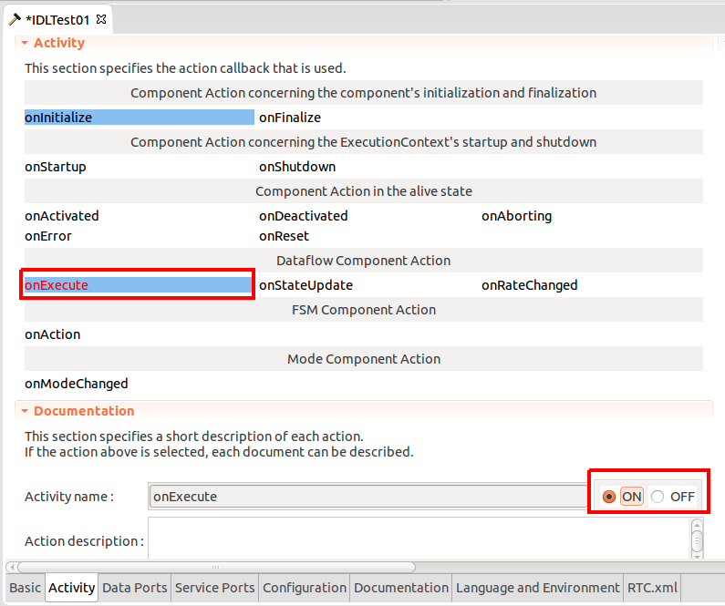
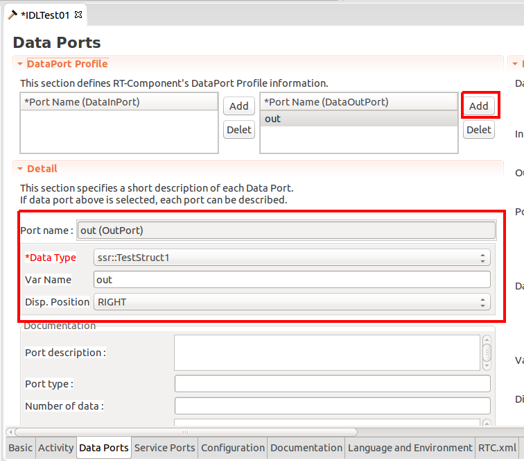
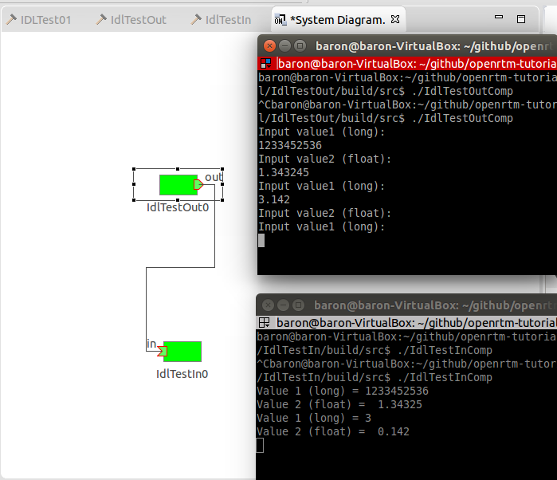

# Step 5: Use DataPort with Original Data Type

Describe IDL file to define your data type and load your IDL file in your RTC builder.

## Definition (IDL file)

Description rules of IDL file is a bit complicated to explain in this website. See CORBA books or some other documentation around IDL file.

```
// TestIDL.idl

module ssr {

  struct TestStruct1 {
    long value1;
    float value2;
  };
};
```

## Setting of Loading IDL file

Open Eclipse and open property dialog. In OSX, Eclipse > Preference.

Then, select RTC Builder in the left side menu of the dialog, and you can see the display like below:



Select the folder that includes your IDL file.
Reboot Eclipse.

## Build RTC with your original data type
You can build the skeleton code in the ordinary 
.




When you select the data type of the data port, you can find your data type is included



## IdlTestIn
Modify IdlTestIn/src/IdlTestIn.cpp as below

```
RTC::ReturnCode_t IdlTestIn::onExecute(RTC::UniqueId ec_id)
{
  if (m_inIn.isNew())
  {
    m_inIn.read();
    std::cout << "Value 1 (long) = " << m_in.value1 << std::endl;
    std::cout << "Value 2 (float) =  " << m_in.value2 << std::endl;
  }
  return RTC::RTC_OK;
}//>
```

## IdlTestOut
Modify IdlTestOut/src/IdlTestOut.cpp as below

```
RTC::ReturnCode_t IdlTestOut::onExecute(RTC::UniqueId ec_id)
{
  std::cout << "Input value1 (long):" << std::endl;
  std::cin >> m_out.value1;
  std::cout << "Input value2 (float):" << std::endl;
  std::cin >> m_out.value2;  
  m_outOut.write();
  return RTC::RTC_OK;
}//>
```

## Build and launch
cmake and make both IdlTestIn and IdlTestOut
Then, launch name service and execute IdlTestIn and IdlTestOut.



