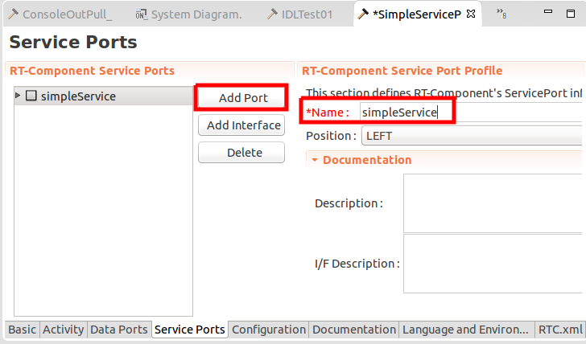
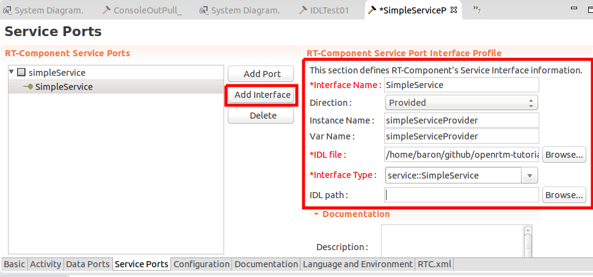
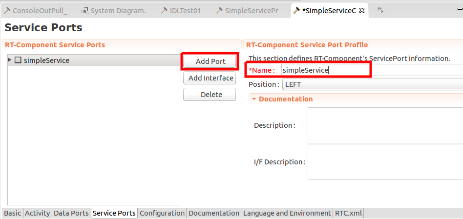
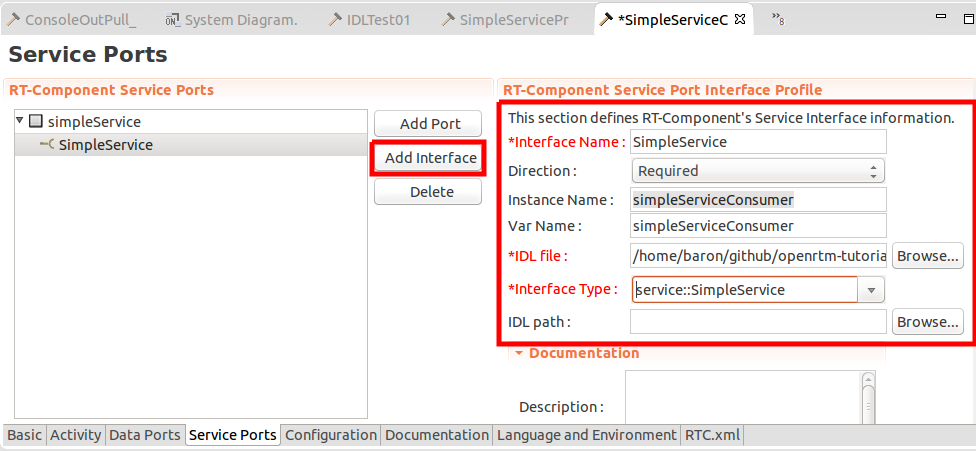
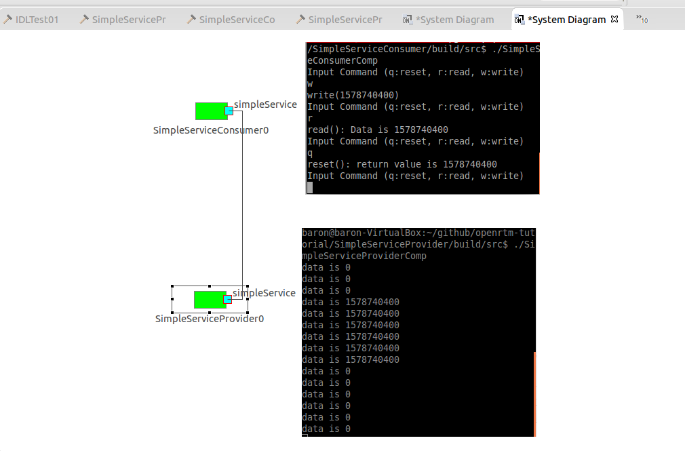

# Step 6: Service Port Communication

Service Port is a function which can be used much more freely like RPC (remote procedure call). Remote component can “call” another RTCs service port. The Remote can also get the result (return value) of the call.

| Pros | Cons |
| ---- | ---- |
| Service Port is very powerful and able to be freely defined. | It is difficult to prepare universal debugging tools. |
| beginners can define anything even if it is dirty, not smart function. | Data Port is very simple and easy to create those debugger (like data logger). |

## IDL
If you want to use Service Port, you need to have IDL (interface definition language) file that defines the service port’s RPC functions.
If you just use Service Port, you can get the IDL of the provider which develops the RTC you want to use.

### How to define interface?
Grammer of IDL is similar to OOP language like Java, C++, and so on. 

Example:
```
/**
 * Filename = SimpleService.idl
 * author: Baron Yong
 **/


module service {

	interface SimpleService {
	  long read  (out long data);
	  long write (in  long data);
	  long reset ();
	};

};
```
Points are…

1. module = package
1. interface is interface. like virtual class in C++.
1. write, read is operation = function (method)

### Direction
To define Operation, you need to give the direction of argument.
In the example, write has in-direction argument that means “call by value”.
read has out-direction argument that means “call by reference”.
IDL also has inout-direction. This can have its initial value.

### Data Type
Some CORBA’s common data type can be used like long, double, and so on.

## RTC Builder
Use RTCB to generate skeleton code.

### SimpleServiceProvider
Select “Service Port” tab, and “Add Port”.


Name” is service port’s name. Position parameter is not important.

Then, “Add Interface” to the Port.
Select the interface you added.


Setting parameter:

* Interface Name
    * SimpleService
* Direction 
    * “Provided”
* Instance Name
    * simpleServiceProvider
* Var Name
    * simpleServiceProvider
* IDL file
    * IDL file. Use “Browse” button, and select the IDL you will use.
* Interface Type
    * You can use pulldown menu and select SimpleService
* IDL path
    * currently its not important.

You need to check following files:

* SimpleServiceProvider.h … definition of RTC
* SimpleServiceProvider.cpp … implementation of RTC
* SimpleServiceSVC_impl.h … definition of Service Port
* SimpleServiceSVC_impl.cpp … implementation of Service Port

The implementation class for Service Port has “read” “write”, and “reset” functions that are defined in the IDL, so modify there functions.
If Consumer RTC calls functions, these implementations are called remotely.

The objects of this class is added automatically in the skeleton of RTC, so RTC can access the properties of service port in the functions like onExecute.

### SimpleServiceConsumer
User of service port are called “consumer”. We can create skeleton code for RTCB.

Select “Service Port” tab, and “Add Port”.


Then, push “Add Interface” button.
Select the interface in the previous step.


Setting parameter:

* Interface Name
    * This value should be the same as Provider. SimpleService
* Direction
    * For consumer, “Required”
* Instance Name
    * instance name of service port class object. “simpleServiceConsumer”
* Var Name
    * name of variable of service port. “simpleServiceConsumer”
* IDL file
    * IDL file. use “Browse” button to select the idl you downloaded before.
* Interface Type
    * Select Interface name with Pull down menu.
* IDL path
    * You do not have to use this.

Consumer side is not particularly different from ordinal RTC project.
In build process, IDL compiler will generate Stub class which will help program to remotely call the services, so you can use service port as consumer.

## Provider side
### Service Port Class
Add “data” member parameter, and write / read it.
Modify SimpleServiceProvider_impl.h, and add “m_data” member to SimpleServiceSVC_impl class.

```
/*!
 * @class SimpleServiceSVC_impl
 * Example class implementing IDL interface service::SimpleService
 */
class service_SimpleServiceSVC_impl
 : public virtual POA_service::SimpleService,
   public virtual PortableServer::RefCountServantBase
{
 private:
   // Make sure all instances are built on the heap by making the
   // destructor non-public
   //virtual ~SimpleServiceSVC_impl();

 public:
  /*!
   * @brief standard constructor
   */
   SimpleServiceSVC_impl();
  /*!
   * @brief destructor
   */
   virtual ~service_SimpleServiceSVC_impl();

   // attributes and operations
   ::CORBA::Long read(::CORBA::Long& data);
   ::CORBA::Long write(::CORBA::Long data);
   ::CORBA::Long reset();

/** Add From Here **/
private:
    long m_data;
public:
    long getData() { return m_data; }
    void setData(long data) {m_data = data;}
};
```

#### Read Operation
In read operation, “data” is read.
```
::CORBA::Long service_SimpleServiceSVC_impl::read(::CORBA::Long& data)
{
  // Please insert your code here and remove the following warning pragma
#ifndef WIN32
  #warning "Code missing in function <CORBA::Long SimpleServiceSVC_impl::read(CORBA::Long& data)>"
#endif
    data = getData();
  return 0;
}
```

#### Write Operation
“In” direction argument is quite simple.
```
::CORBA::Long service_SimpleServiceSVC_impl::write(::CORBA::Long data)
{
  // Please insert your code here and remove the following warning pragma
#ifndef WIN32
  #warning "Code missing in function <CORBA::Long SimpleServiceSVC_impl::write(CORBA::Long data)>"
#endif
    m_data = data;
  return 0;
}
```

#### Reset Operation
In “reset”, data is changed to zero, and the return value is previous data value.
```
::CORBA::Long service_SimpleServiceSVC_impl::reset()
{
  // Please insert your code here and remove the following warning pragma
#ifndef WIN32
  #warning "Code missing in function <CORBA::Long SimpleServiceSVC_impl::reset()>"
#endif
    long old_data = m_data;
    m_data = 0;
  return old_data;
}
```
### Provider Side RTC
SimpleService RTC has simpleServiceProvider which is the object of Service Port class. You can access the data member by getData function that you previously added.
```
RTC::ReturnCode_t SimpleServiceProvider::onExecute(RTC::UniqueId ec_id)
{
	std::cout << "data is " << m_simpleServiceProvider.getData() << std::endl;
  return RTC::RTC_OK;
}//>
```

### Consumer side RTC
In onExecute function, switch function call according to the key-input.
Service Port is added as simpleServiceConsumer.
```
RTC::ReturnCode_t SimpleServiceConsumer::onExecute(RTC::UniqueId ec_id)
{
	std::cout << "Input Command (q:reset, r:read, w:write)" << std::endl;
 
	char c;
	std::cin >> c;
 
	CORBA::Long data;
 
	switch(c) {
		case 'r':
			m_simpleServiceConsumer->read(data);
			std::cout << "read(): Data is " << (long)data << std::endl;
			break;
		case 'w':
			data = (long)rand();
			std::cout << "write(" << (long)data << ")" << std::endl;
			m_simpleServiceConsumer->write(data);
			break;
		case'q':
			data = m_simpleServiceConsumer->reset();
			std::cout << "reset(): return value is " << data << std::endl;
			break;
		default:
			break;
	}
 
	return RTC::RTC_OK;
}//>
```

## Execution
Launch Name Service first, then, execute Provider and Consumer.

Connect both Service ports and activate them all.

Select consumer’s window, and ‘w’ ‘r’ ‘q’ key will invoke the corresponding functions.



## Summary
* Data transportation is done by Data Ports.
* Reset operation can be realized by the state-changed event handler, so usually I do not use reset function.

