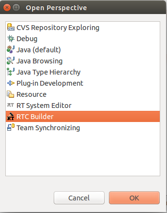
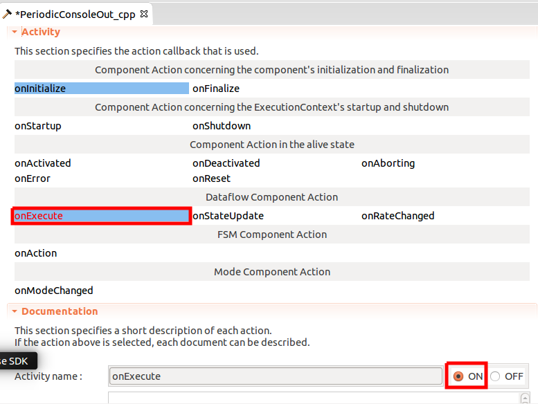
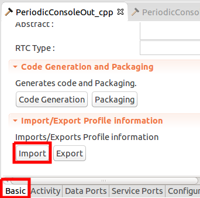

# Tutorial 1: Skeleton Code Generation

## Launch Eclipse-All-In-One
* Launch your "Ecilpse-All-In-One".
* Select "RTC Builder" perspective by choosing "Window"-"Perspective"-"RTC Builder".

## Open RTC Builder Editor
If you select RTC Builder perspective, you can find "Open Builder Editor" button shown in the figure below:

 

Then, you will find an input dialog like below:

 

Please input your "Project Name". This will be used your project's folder name. 
Now, you may find your Builder Editor in the center view of your eclipse. 
In the Builder Editor, input items are categorized, and you must select "tabs" to complete your configuration.

 

## Basic Tab
In Basic Tab menu, you can input your basic information of your RT-components.
 
You can find some items are highlighted in red color, which means the items are need to be input.

In Basic Tab, "Module name", "version", "vendor name", and "category".
The category item is not used in this first step guide. But this item will influence the launching system named "Manager".

## Activity Tab
Please select "Activity Tab" next.

RTCs are "state machine", and the activities (call-backs) are called in the corresponding state transition.

Here, we will use three activities.

* onActivated : called in the transition from Inactive to Active.
* onDeactivated : called in the transition from Active to Inactive.
* onExecute : called periodically when the RTC is Active.

You may imagine that the "onActivated" would be appropriate for initialization method, and "onDeactivated" is "finalization".
That's true.

The RTC Builder will generate a skeleton code which implements these call-backs, and the only thing you must do is to modify the functions.

## Language and Environment
Then, select "Language and Environment" tab.

## Basic Tab
Return to the "basic tab", and let's generate your first RTC's skeleton-codes.
Press "generate" button.

The following image represents an example of output files in C++ environment setting.
