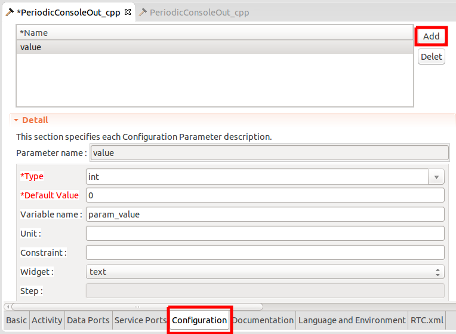
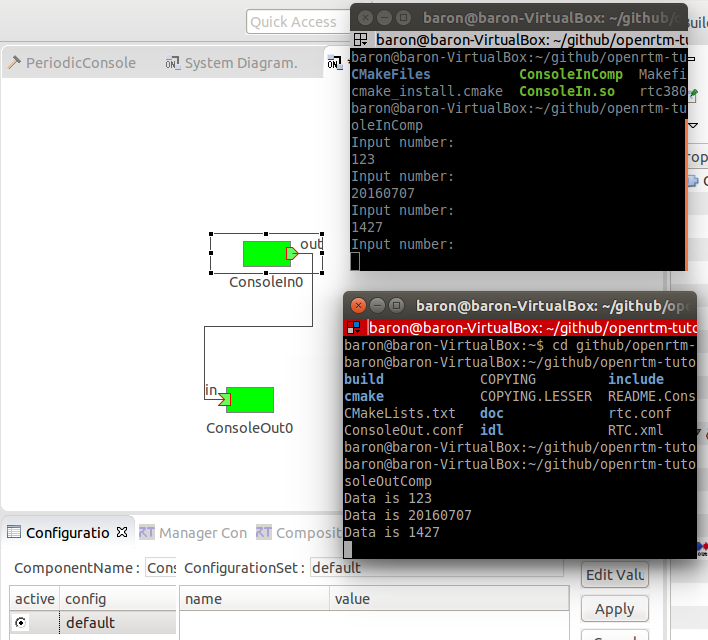

# Tutorial 3: Activate / Deactivate RTC

## Launch RT System Editor
Launch "All-In-One eclipse" and select "RT System Editor" perspective.
(Menu >> Window >> Perspective >> RT System Editor)

## Connect to Name Service
Please connect Naming Service if your RT System Editor do not indicated executing Naming Service (you might see "localhost").
Press "Add Name Server" button and input your Name Server's IP Address (usually, localhost).

 

## Visualize your RTC
Open "RT System Editor view" by pressing the following button.
Then, open your Name Server's tree, and drag & drop the RTC to the opened editor panel.
 

## Activate RTC
Right click your RTC and select "Activate" menu from the drop-down menu.

 

Your RTC will become "GREEN" from "BLUE". The GREEN colored RTC means the RTC is in "ACTIVE" state.
The BLUE RTCs are in "INACTIVE" state.

 

If you watch RED RTCs, they are "ERROR" state.

The RT System Builder can send the trigger to change the RTC's state machine.

When your RTC changes to "ACTIVE" state from "INACTIVE" state, the "onActivated" function is called, so the RTC's console will output some messages in our example.

In ACTIVE state, onExecute function is periodically called.
You will see the following message in your console window of the RTC.

 

If you "deactivate" your RTC, the "onDeactivated" will be called on the contrary.

 

The RTC's parameters (ex., onExecute's period) can be customized by rtc.conf file.

## rtc.conf

The rtc.conf is a setting file of the RTC that can configure the RTCs' common parameter without recompilation.

In "your-path-to-workspace/MyFirstRTC_cpp/" folder, you can find "rtc.conf" file.
The rtc.conf can configure a lot of items, but the generated rtc.conf includes many comments.

Unfortunately, your rtc.conf does not work because we made "build" folder to clarify the skeleton's folder.
Please copy the rtc.conf into the "build/src" folder.
```
$ cp rtc.conf build/src/
```
In default, RT-component will use the rtc.conf in the current folder.
You can also modify the rtc.conf file like:
```
$ ./MyFirstRTCComp rtc.conf
```

## Name Server Address
rtc.conf can define the Name Server's address that the RTC will register on.
```
corba.nameservers: [ip addrdss] : [port number]
```
For example,
```
corba.nameservers: localhost:2809
```
The port number "2809" is the default port number of the Naming Service.

## Naming Rule
In the previous example, you would find your RTC like
```
/localhost:2809/your-PC.host_cxt/MyFirstRTC0.rtc
```
 
This is the default setting:
```
naming.formats: %h.host_cxt/%n.rtc
```
If your rtc.conf has following line:
```
naming.formats: %n.rtc
```
Your RTC will be
```
/localhost:2809/MyFirstRTC0.rtc
```
 

## Execution Period
the onExecute's period can be configured like
```
exec_cxt.periodic.rate: 1.0
```
The unit is "Hz". The default execution rate is 1000 Hz, so in the previous example, you would have seen the super-fast messages flood.
