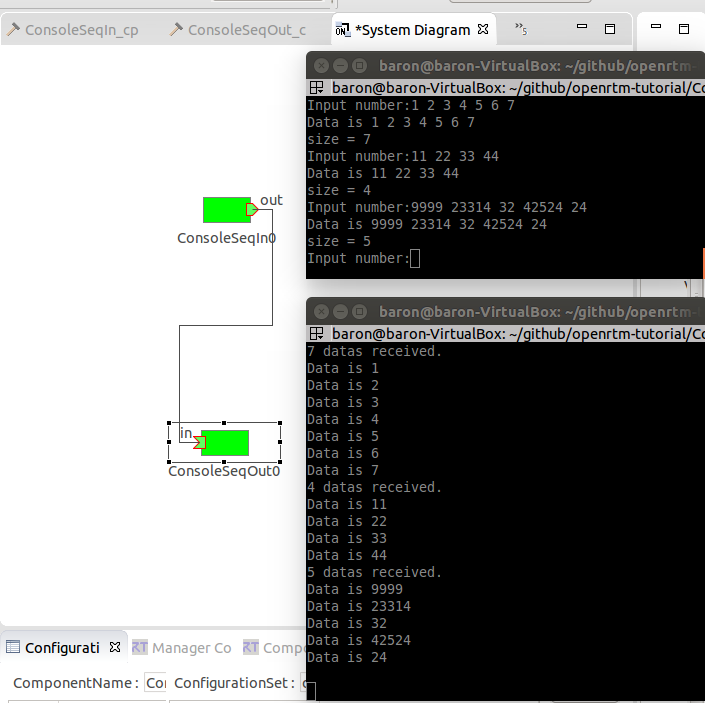

# Tutorial 4: Data Out Port

## Open RTC.xml
Open RTC Builder >> "MyFirstRTC" >> src >> RTC.xml
Select  "Data Port" tab
 

## Add DataOutPort
Add DataOutPort and change "Port Name". Port name is not a variable's name. It's used as an interfaces name usually displayed in RT System Editor.

You can select "Data Type" of your DataOutPort by selecting the drop-down list.

Please edit "Var name" of your DataOutPort. This name is used as a variable name in your cpp code.
 

## Generate Code
Generate Code in Basic tab.

RTC Builder supports incremental development.
Your code and generated code in your project can be merged with the following dialog.

Select merge button.
 

## Edit Code
Open your cpp code and edit "onExecute" code.

m_v_out is a data buffer for the data port "out". The "v_out" is defined in RTC builder as "Var Name".

And you can see "m_v_outOut" that is the Variable name of DataOutPort. The "write" member function means "Output data from data buffer."